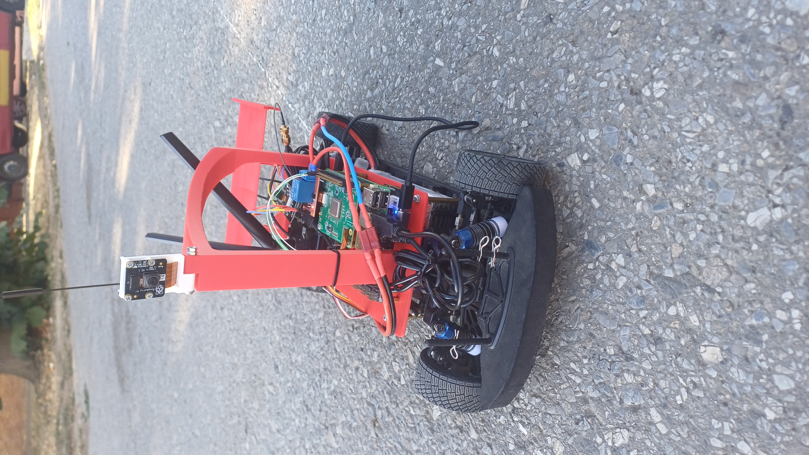
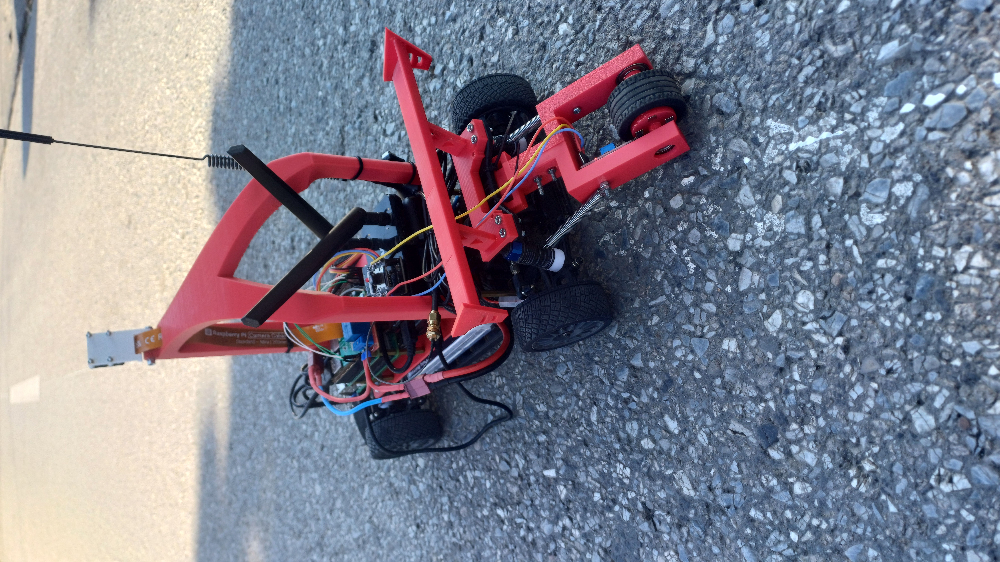
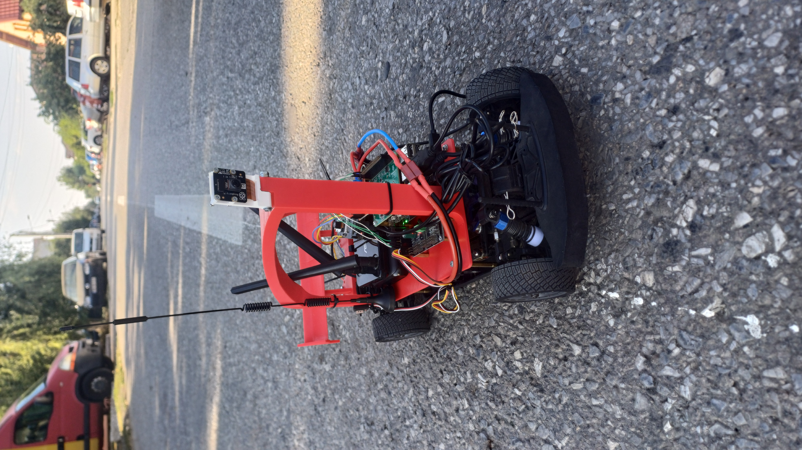

<div align="center">

# 🤖 RoboPacer V2

**An open-source autonomous RC racing robot powered by a Raspberry Pi 5 and a Hailo-8 AI accelerator.**

It records how *you* drive, trains a neural network on that data, then drives itself — maintaining a target speed and steering entirely from a camera feed.

[](https://python.org)
[](https://raspberrypi.com)
[](LICENSE)
[](https://github.com/FrostyTramy/RoboPacerV2)

</div>

---

<div align="center">





*RoboPacer V2 — red 3D-printed frame, brushless drivetrain, Raspberry Pi 5 + Hailo AI Kit on top.*

</div>

---

## What is RoboPacer V2?

RoboPacer V2 is a fully autonomous RC car you build yourself. It learns to steer by watching you drive, then runs that model live on a dedicated AI chip at inference time. A PI cruise-control loop holds whatever speed (km/h) you tell it to maintain over a target distance. Everything — training, live telemetry, lap control — is managed from a web dashboard running on the Pi itself.

### Key features

| Feature | Details |
|---|---|
| **AI steering** | Hailo-8 neural net, runs the `.hef` model in real time from the Pi Camera v2 |
| **Cruise control** | Feedforward + PI regulator, Hall-sensor RPM feedback, 10-second pace-recovery |
| **Data recorder** | Saves timestamped frames + steering angles for training |
| **Trainer (Windows/Linux)** | Web UI — pick dataset, set epochs/batch, click Start. Compiles to `.hef` via Docker |
| **Web dashboard** | Live console, autopilot launcher, system stats — runs on the Pi as a systemd service |
| **Safety system** | Relay E-stop, BLE watchdog via Garmin watch, 2-second heartbeat kill-switch |
| **Manual drive** | Xbox controller input, always available as fallback |

---

## Hardware

| Component | Part |
|---|---|
| **SBC** | Raspberry Pi 5, 8 GB |
| **AI chip** | Hailo AI Kit (M.2 HAT, 26 TOPS) |
| **Camera** | Raspberry Pi Camera Module v2.1 (IMX219) |
| **Motor** | Surpass Hobby Rocket 540 Sensored Brushless, 13.5T |
| **ESC** | Hobbywing QuicRun 10BL120 (sensored mode) |
| **Servo driver** | PCA9685 over I2C — steering on ch.0, ESC on ch.1 |
| **Speed sensor** | KY-024 Hall sensor (4 magnets on wheel) → ESP32-CAM → Pi over serial |
| **Pi power** | Hama 10 000 mAh PD power bank → 12 V→5 V step-down board |
| **Drive battery** | 3S LiPo, 5 500 mAh, 11.1 V (ESC + motor + servo) |
| **Secondary WiFi** | ASUS USB-N14 on USB 3.0 — dedicated `RoboPacer` hotspot |
| **Safety relay** | ESP32-CAM (`garmin_receiver.ino`) — BLE + serial relay control + heartbeat watchdog |

Full hardware details: [HARDWARE.md](HARDWARE.md) · Camera spec: [CAMERA_SPEC.md](CAMERA_SPEC.md) · Safety wiring: [SAFETY.md](SAFETY.md)

---

## How it works

```
┌─────────────────────────────────────────────────────────┐
│                  Raspberry Pi 5 (on-robot)              │
│                                                         │
│  Pi Camera v2  ──►  Hailo-8 (.hef model)  ──► steering │
│                                                 │       │
│  ESP32 RPM ──► estop_listener.py ──► cruise PI ┘       │
│                         │                               │
│              PCA9685 ──► servo + ESC                    │
│                                                         │
│  dashboard/app.py  (Flask, systemd service)             │
│  ──► autopilot launcher, live console, system stats     │
└─────────────────────────────────────────────────────────┘

┌─────────────────────────────────────────────────────────┐
│               Windows / Linux (your laptop)             │
│                                                         │
│  trainer/  ──► train.py (PyTorch) ──► ONNX             │
│              ──► Docker + Hailo DFC ──► model.hef       │
│              ──► copy .hef to Pi                        │
└─────────────────────────────────────────────────────────┘
```

---

## Getting started

### 1. Set up the Pi

```bash
# Clone on the Pi
git clone https://github.com/FrostyTramy/RoboPacerV2.git
cd RoboPacerV2

# Install Python dependencies
pip install -r requirements.txt   # (or per-module as needed)

# Enable the dashboard + safety services
sudo cp dashboard/robopacer-dashboard.service /etc/systemd/system/
sudo cp safety/estop-listener.service /etc/systemd/system/
sudo cp safety/esc-watchdog.service /etc/systemd/system/
sudo systemctl enable --now robopacer-dashboard estop-listener esc-watchdog
```

The dashboard is now reachable at `http://<pi-ip>:5000` from any device on the same network.

---

### 2. Calibrate the servo and ESC

Before driving, run the calibration tools once so the PWM limits match your hardware:

```bash
# Servo centre + throw
python3 tools/servo_calibrate.py

# Confirm odometry matches a tape measure
python3 tools/odometry.py
```

---

### 3. Record a dataset

Drive the robot manually while the data recorder captures every frame + your steering angle:

```bash
python3 data_recorder/data_recorder.py
# Output: data_recorder/set1/driving_log.json + frames/
```

Drive a mix of straights and turns — the more variety, the better the trained model. Aim for at least a few hundred frames per turn direction.

---

### 4. Train the model (on your laptop)

Copy the dataset folder from the Pi to your Windows/Linux machine:

```bash
# In trainer/
pip install -r requirements.txt
# (or just double-click start.bat on Windows)
```

**Before a long run, always smoke-test first:**

1. Open `http://localhost:5000`
2. Click **"Test export (0 epochs)"** — verifies Docker + Hailo DFC wheel in seconds
3. If it passes, set your real epochs/batch size and click **Start**

> **Requirements for compile:** Place `hailo_dataflow_compiler-3.34.0-py3-none-linux_x86_64.whl` at `trainer/engine/compile/resources/` (free download from [hailo.ai/developer-zone](https://hailo.ai/developer-zone/)) and make sure Docker Desktop is running.

The trainer outputs `models/<name>.hef` + `.pth`. Copy the `.hef` back to the Pi:

```bash
# Drop the .hef next to main.py (autopilot) and/or model_runner.py (steering-only)
scp models/mymodel.hef pi@<pi-ip>:~/RoboPacerV2/main/
```

Exactly **one** `.hef` must exist in whichever folder you launch from.

---

### 5. Run the robot

#### Autopilot (steering + cruise control)

```bash
python3 main/main.py --target-kmh 10 --distance-m 500
```

- The car **does not move** until you press **[A]** on the controller.
- Press **[B]** at any time to stop immediately.
- Or launch it from the dashboard's **Autopilot** page — it fills in the speed/distance form for you.

#### Steering only (no cruise control)

```bash
python3 model_runner/model_runner.py
```

#### Manual drive

```bash
python3 manual_drive/manual_drive.py
```

#### Cruise control only (human steering)

```bash
python3 cruise_control/cruise_control.py --target-kmh 10
```

---

### 6. Safety system

The ESP32-CAM (`Esp32/garmin_receiver/`) sits between the 3S LiPo and the ESC and does two things independently:

- **Relay** — cuts power to the ESC, motor, and servo in a single switch. Triggered by script (`estop_listener.py`), by your Garmin watch over BLE, or by the ESP32's own 2-second heartbeat watchdog if the Pi stops talking.
- **Speed sensor** — reads the Hall sensor and streams `RPM:x.xx` lines to the Pi over serial, relayed to all driving scripts via `/tmp/esp32_odometry.sock`.

Full wiring and fail-safe details: [SAFETY.md](SAFETY.md)

---

## Project structure

```
RoboPacerV2/
├── main/               # Autopilot — steering (Hailo) + cruise control
├── model_runner/       # Steering-only inference
├── cruise_control/     # Speed regulator (no AI steering)
├── manual_drive/       # Xbox controller drive
├── data_recorder/      # Record frames + angles for training
├── camera/             # Camera helpers
├── trainer/            # Windows/Linux training UI (PyTorch → ONNX → .hef)
├── dashboard/          # Flask web dashboard + systemd service
├── safety/             # E-stop listener + ESC watchdog services
├── tools/              # Calibration, odometry, log plotting
├── Esp32/              # ESP32-CAM firmware (relay + speed sensor + BLE)
├── HARDWARE.md
├── CAMERA_SPEC.md
└── SAFETY.md
```

---

## Contributing

Pull requests are welcome. For bigger changes, open an issue first so we can discuss the direction. The main areas that could use help:

- Better lane-keeping datasets and model architectures
- Object detection / obstacle avoidance
- Improved dashboard UI
- More robust BLE pairing flow

---

## License

This project is open source and available under the [MIT License](LICENSE).

---

<div align="center">

Built with a lot of soldering, a few crashes, and way too many late nights. — *FrostyTramy*

</div>
